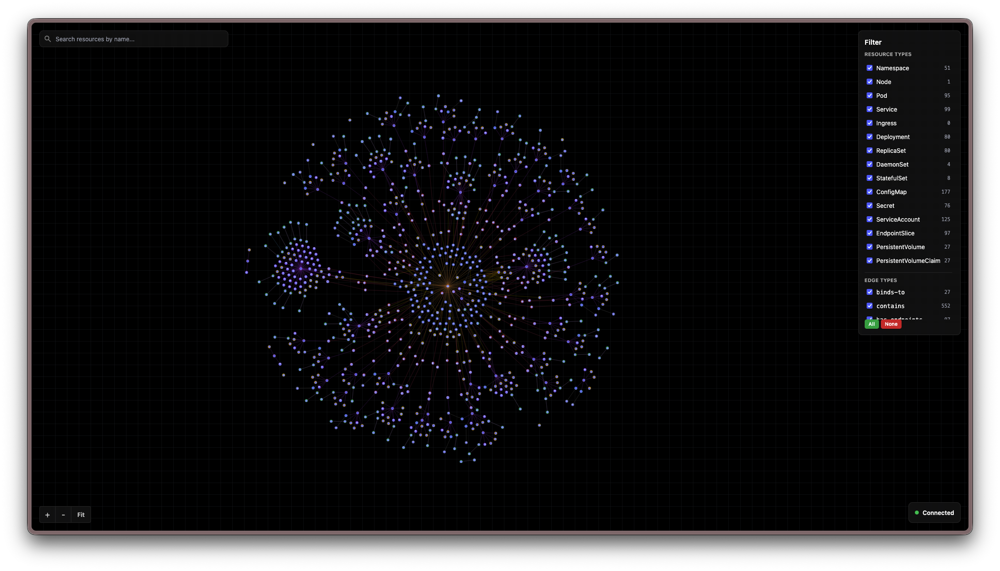

# Kube Visualizer

Interactive Kubernetes resource graph for exploring live cluster topology.



Kube Visualizer streams Kubernetes resources from a Node.js backend and renders them in a React + D3 force-directed graph. It is built for quickly inspecting how namespaces, nodes, workloads, pods, services, ingresses, secrets, config maps, endpoint slices, and volumes relate to each other.

## Features

- Live cluster updates through Server-Sent Events
- D3 force-directed graph with zoom, pan, node drag, hover details, and click details
- Relationship edges for ownership, namespace containment, service selection, ingress routing, node hosting, pod config references, endpoint slices, and PVC/PV binding
- Resource and edge type filters
- Resource search and detail panel
- Mobile-friendly controls with a compact bottom filter panel
- Kubernetes icon set for graph nodes and resource details

## Workspace

```text
apps/backend     Kubernetes API watcher and SSE server
apps/visualizer  React, Vite, Tailwind, and D3 frontend
```

## Requirements

- Node.js with pnpm
- Access to a Kubernetes cluster through one of:
  - `KUBECONFIG`
  - in-cluster service account configuration
  - default local kubeconfig

## Install

```bash
pnpm install
```

## Development

Run the backend:

```bash
pnpm --filter backend dev
```

Run the visualizer:

```bash
pnpm --filter visualizer dev
```

By default, the frontend calls the backend through the current origin using `/events` and `/api/*`. For split local development, set `VITE_API_URL` when needed:

```bash
VITE_API_URL=http://localhost:3000 pnpm --filter visualizer dev
```

## Build

```bash
pnpm build
```

Or build each app:

```bash
pnpm --filter backend build
pnpm --filter visualizer build
```

## Verification

```bash
pnpm --filter backend build
pnpm --filter visualizer lint
pnpm --filter visualizer build
pnpm audit --audit-level low
```

The root `pnpm test` script is currently a placeholder and exits with an error.

## Backend API

- `GET /events` streams graph deltas as SSE.
- `GET /api/resources` returns all known resources with full details.
- `GET /api/resource/:id` returns one resource by encoded graph id, for example `Pod:default/nginx` or `Namespace:/default`.

The backend suppresses empty graph deltas and sends heartbeat comments periodically to keep the SSE connection alive.

## Notes

The graph only creates relationship edges when both endpoint resources exist in the current backend state. This avoids dangling edges while still allowing secrets, config maps, endpoint slices, and node-hosted pods to attach as soon as the server has both sides.
